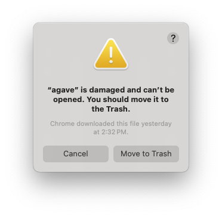

# Installation Instructions

You can access the [latest installer release here](https://github.com/allen-cell-animated/agave/tags).

## Windows

Download the installer `agave-1.9.0-rc.1-win64.exe` and run it.

It will take you through the installation process. In most cases you can accept all the default settings.

Once installed, you can run the application from the start menu.
The first time, you will get a warning from Windows Defender SmartScreen. Click on "More info" and then "Run anyway".

## MacOS

We provide separate installers for MacOS with Apple Silicon (Macs with M1-M4 processors) and MacOS with Intel processors.

The Intel (x86-64) version should work on all Macs. However, you will get the best performance by choosing the matching installer. You can check your Mac's processor architecture by clicking the Apple menu, selecting About This Mac. Look for the Processor Name.

### MacOS with Apple processors

Download the installer `agave-1.9.0-rc.1-macos-arm64.dmg` and open it.

Drag the agave icon to the Applications folder.

You can now run the application from the Applications folder.

### MacOS with Intel processors

Download the installer `agave-1.9.0-rc.1-macos-x86-64.dmg` and open it.

Drag the agave icon to the Applications folder.

You can now run the application from the Applications folder.

### MacOS final step

If you get a warning that the application is damaged:



Press Cancel, and then run the following command in the terminal to remove the quarantine attribute:
(BEFORE YOU DO THIS, MAKE SURE YOU TRUST THE SOURCE OF THE DOWNLOADED APPLICATION)

(Intel processors)
```
xattr -d com.apple.quarantine /Applications/agave.app
```

(Apple processors)
```
codesign --force --deep --sign - /Applications/agave.app
```

After this, you should be able to run the application.
For more information, see [Apple's support page](https://support.apple.com/en-us/HT202491).
