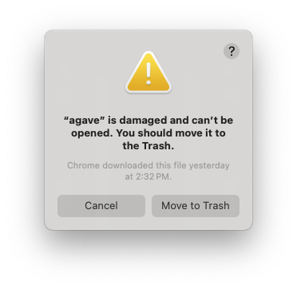

# Installation Instructions

You can access the [latest installer release here](https://github.com/allen-cell-animated/agave/tags).

## Windows

Download the installer `agave-1.10.0-win64.exe` and run it.

It will take you through the installation process. In most cases you can accept all the default settings.

Once installed, you can run the application from the start menu.
The first time, you will get a warning from Windows Defender SmartScreen. Click on "More info" and then "Run anyway".

## MacOS

AGAVE supports Apple Silicon Macs.

Download the installer `agave-1.10.0-macos-arm64.dmg` and open it.

Drag the agave icon to the Applications folder.

You can now run the application from the Applications folder.

### MacOS final step

If you get a warning that the application is damaged:



Press Cancel, and then run the following commands in the terminal to remove the quarantine attribute:
(BEFORE YOU DO THIS, MAKE SURE YOU TRUST THE SOURCE OF THE DOWNLOADED APPLICATION)

```
xattr -d com.apple.quarantine /Applications/agave.app
codesign --force --deep --sign - /Applications/agave.app
```

After this, you should be able to run the application.
For more information, see [Apple's support page](https://support.apple.com/en-us/HT202491).
