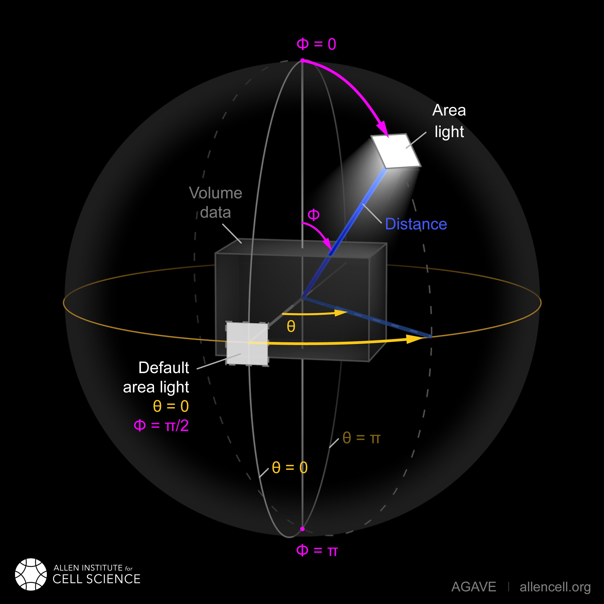
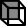

User Interface Overview
-----------------------

AGAVE is a windowed desktop application.

The application is divided into several panels. All of the panels except
for the 3D view can be undocked by dragging their title bar with the
mouse. Undocked panels can float independently or the interface can be
reconfigured by re-docking them in a different position. Note:
currently, restarting AGAVE will reset the interface to the default
configuration.

All panels can be resized by dragging from their edges. Your cursor
should change to indicate when you are hovering over an edge that can be
resized.

Tip: On some screens, the panels may be too narrow to have enough range
to move the horizontal sliders. In that case, it can help to un-dock the
panel and stretch it wider.

If you close any panels, you can always reopen them from the View menu.

Loading volume data
-------------------

AGAVE can load multi-scene, multi-time, and multi-channel files. It can
present up to 4 channels concurrently and offers a time slider when time
channels are detected.

Metadata embedded in the file is important for AGAVE to display the
volume properly. AGAVE can decode OME metadata (OME-TIFF files), ImageJ
metadata (TIFF files exported from ImageJ/FIJI), Zeiss CZI metadata, and OME-Zarr metadata.

We recommend preparing or converting your volumetric files to OME-TIFF or OME-Zarr
(see `Preparing an AGAVE Compatible ome-tiff file with
Fiji <#preparing-an-agave-compatible-ome-tiff-file-with-fiji>`__ to
ensure the expected data structure, channel order, etc.)

AGAVE currently supports the following file formats:
* .zarr (OME-Zarr only - https://ngff.openmicroscopy.org/latest/)
* .ome.tiff (see https://docs.openmicroscopy.org/ome-model/latest/)
* .tiff
* .czi (Produced by Zeiss microscopes. See https://www.zeiss.com/microscopy/en/products/software/zeiss-zen/czi-image-file-format.html)
* .map/.mrc (Typically used in electron cryo-microscopy. See https://www.ccpem.ac.uk/mrc_format/mrc_format.php)
AGAVE can read 8-bit, 16-bit unsigned, or 32-bit float pixel intensities.  

OME-Zarr data is not stored as single files - instead it is a directory.  AGAVE can load OME-Zarr data either from a local directory or from a public cloud URL using https, s3, or gc protocols.

Open file, directory or URL
~~~~~~~~~~~~~~~~~~~~~~~~~~~

File-->Open file or \[Open file\] toolbar button
File-->Open directory or \[Open directory\] toolbar button
File-->Open from URL or \[Open from URL\] toolbar button

\[Open file\] will pop open a file browser dialog in which you can navigate to the
volume file of choice.  Check the "Image Sequence" checkbox if your directory contains a time sequence of individual TIFF files.
\[Open directory\] will pop open a directory browser dialog in which you can navigate to the
OME-Zarr store of choice.
\[Open from URL\] will pop open an input dialog in which you can enter the URL to the
OME-Zarr store of choice.  Currently only publicly accessible URLs are supported.

Once the data source location (file, directory or URL) is selected, if the data is multi-scene, a dialog will
pop up to let you select the scene you wish to view. To view a different
scene, just re-open the same data location.

If the data you select cannot be opened or loaded for any reason, an error dialog will pop open
to notify you. There are several possible reasons why this operation may
fail and if AGAVE can determine the reason, it will be displayed in the
`AGAVE log <#agave-log>`__.

One the data source has been selected, the `Load Settings <#load-settings>`__ dialog will then appear to let you finalize choices for the data to be loaded.

Open JSON
~~~~~~~~~

File-->Open JSON or \[Open JSON\] toolbar button

\[Open JSON\] can be used when you have previously saved an AGAVE session. This will
load the volume file associated with that session, along with all of the
AGAVE settings as they were when you saved (if you encounter problems,
see `Save JSON <#save-json>`__ below for details about proper file and
filepath structure).

Recent
~~~~~~

File-->Recent...

This menu will present a list of the most recently opened volume files
for quick selection if AGAVE was previously used on your computer.
This choice will then open the `Load Settings <#load-settings>`__ dialog.

Load Settings
-------------

In order to support loading from very large datasets, AGAVE can load subsets of data 
based on precomputed multiresolution levels stored in the data, time series, channels, 
and in some cases sub-regions within the spatial volume data. 

OME-Zarr supports all of the above selections when present in the data.  Other formats are more restrictive and may only support a few of the options.
The Load Settings dialog presents you with a memory estimate of how much data will be loaded with current settings.  Coupled with knowledge of your own system's configuration, this allows you to make informed choices about how much data to load.
The memory estimate is an expected estimate of how much GPU memory AGAVE will use for rendering.  Main memory usage may be higher, but is not indicated as usually GPU memory is the limiting factor.

Resolution Level
~~~~~~~~~~~~~~~~

The OME-Zarr format supports precomputed multiresolution data and will let you select the resolution level.
The highest resolution is the default, so beware if you have a large dataset, you risk running out of memory. 

Time
~~~~

If you are loading time-series data, you may select the initial time to load.
You will be able to change the current time point after the data is loaded. 
(See `Time Panel <#time-panel>`__)

Channels
~~~~~~~~

You may choose to exclude certain channels from being loaded.  
All channels will be selected by default. If you leave channels out, be aware you will have to reload the file to get them back.

Subregion
~~~~~~~~~

For OME-Zarr data, you may select a sub-region in X, Y, and Z. This is useful for loading a subset of a large dataset.
A typical usage might be to first load a very low resolution level and then select a sub-region of interest to then load at a higher resolution.

Keep Current AGAVE Settings
~~~~~~~~~~~~~~~~~~~~~~~~~~~

If you have already loaded a volume file and have made changes to the appearance, channel intensities, lighting, etc., you can choose to keep those settings when loading a new volume file.
This is useful if you are loading several images consecutively that have similar channels and dimensions, and want to apply a consistent appearance to each.

Adjusting the camera view
-------------------------

The 3D viewport in AGAVE supports direct manipulation by *zoom*, *pan*,
and *rotate*.  It also provides a toolbar with some convenient buttons 
for common view settings.

Rotate
~~~~~~

To rotate the volume, left-click and drag the mouse.

Zoom
~~~~

To zoom in or out, right-click and drag up or down. On Mac trackpad,
Command-click and drag up or down, or drag up or down with two fingers
as if scrolling.

Pan
~~~

To slide the camera parallel to the screen, middle-click and drag in the
view. On Mac, Option-click and drag in the view.

|image1| Reset
~~~~~~~~~~~~~~

The \[Reset\] button in the toolbar will return your camera to the default view position
as if the volume were freshly loaded.

|image2| Frame View
~~~~~~~~~~~~~~~~~~~

The \[Frame View\] button in the toolbar will frame the volume data in the window.
This is useful if you have zoomed or panned away from the volume data and want to 
quickly return to a view that shows the entire volume, but keep the rotation angle.

|image4| |image3| Perspective/Orthographic
~~~~~~~~~~~~~~~~~~~~~~~~~~~~~~~~~~~~~~~~~~

The \[Persp/Ortho\] toolbar button will toggle between a perspective projection and an
orthographic one. In a perspective projection, parallel lines will meet
in the distance and 3D objects will be foreshortened. This is considered
a "realistic" view. In orthographic projection, parallel lines receding
into the distance will remain parallel no matter which direction they
go. There is no foreshortening or tapering of the volume.

|image5| Quick Views |image6| |image7| |image8| |image9| |image10| |image11|
~~~~~~~~~~~~~~~~~~~~~~~~~~~~~~~~~~~~~~~~~~~~~~~~~~~~~~~~~~~~~~~~~~~~~~~~~~~~

The \[Quick Views\] toolbar button will pop open a menu of quick views that will
automatically rotate the volume to a particular angle. The views are
Front, Back, Top, Bottom, Left, and Right to align your viewport perfectly 
looking along the X, Y or Z axes from either direction.

|image12| Show axes
~~~~~~~~~~~~~~~~~~~

The \[Show axes\] toolbar button will toggle the display of the X,Y,Z coordinate
axes in the lower left corner of the viewport.

Appearance Panel
----------------

The appearance panel has the majority of the controls you will use to
adjust the image. In particular, you will adjust volume channel
intensities and colors, control how transparent or opaque the volume
appears, and control lights and shadows.

| This panel is split into the following subsections, each detailed below:
| [*Global Rendering* controls], [*Volume Scale* controls], [*Region of Interest Clipping*\ ], [*Lighting per-channel*\ ], [*volume data*\ ] controls (only appear after a volume has been loaded).

Global Rendering Settings
~~~~~~~~~~~~~~~~~~~~~~~~~

Renderer
^^^^^^^^

Select \[Path Traced\] for the standard high quality rendering system. Select \[Ray March Blending\]
for a faster performing but simplified renderer. The Ray Marching
renderer will not do advanced lighting and shadowing, but can still
provide a useful view of your volume data. It does not behave in a
progressive fashion, instead giving you the finished image immediately
with no waiting.

Scattering Density
^^^^^^^^^^^^^^^^^^

*Scattering density* controls how dense (opaque) or sparse (translucent)
the volume appears. Higher density can be helpful for objects with well
defined edges and less noisy data. It also tends to bring out the
lighting in a more pronounced way. Lower density can be useful for
multichannel viewing in which the data has a lot of overlap.

Shading Type
^^^^^^^^^^^^

There are two shading methods: \[BRDF\] and \[Phase\]. The \[Mixed\]
setting combines the two and is the default. The BRDF (Bidirectional
Reflectance Distribution Function) is more sensitive to lighting angle
and can produce a shiny reflective appearance, whereas the Phase
function does not produce glossy highlights.

Shading Type Mixture
^^^^^^^^^^^^^^^^^^^^

In Mixed shading mode, this slider controls the relative contribution of
Phase and BRDF.

Primary Ray Step Size
^^^^^^^^^^^^^^^^^^^^^

The *primary ray step size* controls the distance rays can travel into
the volume before hitting something. Larger values will render faster
but also result in some rays bypassing important parts of the volume.
This can be used for quicker preview rendering. Smaller values will be
more precise and ensure that you are capturing every detail in the
volume data.

Secondary Ray Step Size
^^^^^^^^^^^^^^^^^^^^^^^

The *secondary ray step size* controls the distance rays will travel
after they have scattered within the volume and are bouncing out toward
the light sources. Higher values will brighten the image and reduce
shadows because more rays will penetrate through the volume and make it
out to the lights. Smaller values will ensure that some rays are stopped
by volume data, which will increase the accuracy of cast shadows.

Interpolate
^^^^^^^^^^^

Check this box to enable or disable interpolation between volume pixels. 
Turning it off will work well for segmentation data or data that has definite
discontinuous boundaries. Turning it on (the default) will smooth out the 
data and make it look more continuous, and can enhance the appearance of raw
microscopy image data.

Background Color
^^^^^^^^^^^^^^^^

Clicking on the color square next to Background Color allows you to
change the image background color from black (default) to any other
color.

Bounding Box
^^^^^^^^^^^^

Click the checkbox to show or hide a bounding box line around the volume data.
Clicking on the color square allows you to select a color for the bounding
box lines.

Scale Bar
^^^^^^^^^

Click the checkbox to show or hide a scale bar at the bottom right corner
of the display.  In a perspective camera, due to foreshortening, the
scale bar will represent the distance between tickmarks shown on the 
bounding box of the volume.  You will have to have the bounding box turned on
in order to see it.  The scale bar will use physical units if available 
in the loaded volume data.

Volume Scale
~~~~~~~~~~~~

These X, Y, and Z values describe the physical dimensions of the volume
data relative to the number of pixels. Often microscopes do not have the
same physical dimensions in Z that they do in X and Y. Usually these
values are read from the volume file's metadata. If they could not be
found in the metadata, they will often appear here as X=1, Y=1, Z=1.
They can be modified here.
Each axis can also be inverted by checking the corresponding "Flip" 
checkbox.

Region Of Interest (ROI)
~~~~~~~~~~~~~~~~~~~~~~~~

Three sliders presented here let you clip the volume along each of its
three axes. These sliders have two handles each, which let you clip each
dimension from either side. For example, to see only the bottom Z half
of your volume (or display the cross section middle slice), move the
rightmost Z handle about halfway to the left.

Clip Plane
~~~~~~~~~~

The clip plane is a plane that can be moved through the volume to cut it
in half. The plane can be moved in X, Y, and Z, and rotated to any angle.
Check the checkbox to enable or disable the clipping.
Check "Hide" to make the clip plane grid indicator disappear.
Click "Rotate" or "Translate" to enable viewport controls to let you move
the clip plane interactively. Click the Rotate and Translate buttons
a second time to disable the viewport controls. See \[Rotate\] below for more details.

Lighting
~~~~~~~~

There are two types of light illuminating your volume. One is an “Area
Light”, represented by an imaginary square-shaped light source that can
be moved anywhere around the volume. The second is a “Sky Sphere”, which
can illuminate the volume from all directions.

Tip: it can be useful to turn one light off while tuning the settings
for the other.

Area Light Theta, Phi, and Distance
^^^^^^^^^^^^^^^^^^^^^^^^^^^^^^^^^^^

These three coordinates let you position the light anywhere on a sphere
around the volume. Theta and Phi are in radians (where 3.14159 radians
is half a circle).

Rotate
^^^^^^

If you click "Rotate", an
interactive rotation widget will appear in the viewport.  You can click
and drag on the widget to rotate the light direction around the volume.
If you click on the colored lines of the axes, rotation will be 
constrained to that axis.  Press R again or uncheck the checkbox to
hide the rotate manipulator.

|image0|

Area Light Size
^^^^^^^^^^^^^^^

The size of the light controls the spread of its illumination over the
volume. A smaller light closer to the volume will appear very dramatic
with exaggerated shadows, due to its rays spreading over a wide angle. A
larger light will give a more even illumination.

Area Light Intensity
^^^^^^^^^^^^^^^^^^^^

You may select a RGB color for the area light, and modify it with a
scalar intensity value to brighten or darken it. Note that you can turn
the light off by setting its color to black or its intensity to 0.

SkyLight Top, Middle, and Bottom
^^^^^^^^^^^^^^^^^^^^^^^^^^^^^^^^

The Sky Light is described by a sphere completely surrounding the
volume. You can set a color and intensity for the "north pole" (Top) of
the sphere, the "equator" (Middle) and the "south pole" (Bottom). These
values will be interpolated to compute the light at any point in
between. The Sky Light can be turned off by setting its intensities to 0
or its colors to black.

Volume Channel Settings
-----------------------

Each volume channel contains adjustable settings. Expand the channel
menus to access the following parameters.

Transfer Function Editor
~~~~~~~~~~~~~~~~~~~~~~~~

The transfer function editor lets you transform the intensity values in
your volume data to clarify and fine-tune your visual analysis. You can
select particular intensity ranges to view, to pick out particular
details in the volume.

The editor displays a graph at the top. The background of the graph
contains a histogram in black, showing where the volume intensity is
distributed (Y axis) along the intensity range (X axis). The white line
shows how volume intensities X are remapped to new intensities Y.

The editor has 4 mutually exclusive modes. You can switch between any of
the modes and each mode's settings will be remembered.

Window / Level
^^^^^^^^^^^^^^

Window/Level lets you remap the data range to a narrower range and clip
data above and below the selected range. AGAVE provides two controls:
one to define how wide the range is (the window), and another to control
where the window lies in the raw intensity range (the level).

Isovalue
^^^^^^^^

Isovalue lets you select a range of intensity values and clips all other
values to 0. You may select a middle intensity value and a range of
values above and below it. A thinner range will let you isolate one
particular intensity.

Histogram Percentile
^^^^^^^^^^^^^^^^^^^^

Percentile mode is similar to Window/Level as it results in the same
linear remapping, but the choice of start and end is based on a
percentage of the total pixels in the image. The default is to clip the
bottom 50% of pixels to zero, and clip the upper 2% of pixels to
maximum.

Custom
^^^^^^

In Custom mode, you are free to edit the graph yourself. You will create
your own piecewise linear transfer function. You start by default with a
1-1 intensity remapping, with one point in the bottom left corner and
another in the upper right. Click in the graph anywhere to create a new
vertex. It will be represented by a white circle. Click the middle of a
circle and drag to move it.

Color settings
~~~~~~~~~~~~~~

ColorMap
^^^^^^^^

The colormap is a gradient that maps intensity values to colors. You can
select from a variety of built-in colormaps.  
The color map will be applied between the min and max values of the transfer function.
If you are using a "Custom" transfer function then there may be no inherent min and max,
and so then the color map will be applied to the whole data range.
To disable the color map,
select the first entry (labeled as "none"). If your data is discrete labels
such as a segmentation, you may use the final entry in the list, "Labels",
which will assign a unique color to each unique intensity value.
Note that the colormap colors will be multiplied with the \[Color\] setting.
Set Color to white to see the colormap directly. 

Color
^^^^^

This should be thought of as the main color for this channel.
Set this to white in order to use the color map without any extra
color tinting.

Specular Color
^^^^^^^^^^^^^^

This is the color for reflective highlights. It is additive on top of
the diffuse color. Leave it at black to have no shiny highlights at all.
This color should be tuned in conjunction with the Glossiness slider.

Emissive Color
^^^^^^^^^^^^^^

This color is not truly light-emitting, but can not be darkened by the
effects of shadowing from other lights. It should be used sparingly, if
at all.

Glossiness
^^^^^^^^^^

The glossiness value controls how sharp the reflected Specular
highlights are. It defaults to a low value which makes them seem more
diffuse. Higher values will appear shinier or glossier.

Output: Saving Results
----------------------

Quick Render
~~~~~~~~~~~~

File-->Quick render or the \[Quick render\] toolbar button

Save the current viewport window as a PNG, or JPG file.

Render
~~~~~~

File-->Render or the \[Render\] toolbar button

Opens the `Render Dialog <#render-dialog>`__

Save JSON
~~~~~~~~~

File-->Save to JSON or \[Save to JSON\] toolbar button

Save to JSON will save the current AGAVE session into a small file that
records every setting so you can pick up work where you left off. The
JSON file is a text file, which you can (carefully) hand-edit if you
need to. The file name of the currently loaded volume file is embedded
in the JSON, so if you copy the file around you should bring the volume
data file with it. It is best to keep them in the same directory if
possible.

Save To Python Script
~~~~~~~~~~~~~~~~~~~~~

File-->Save to Python script or \[Save to Python script\] toolbar button

Save to Python script will save the current AGAVE session into a small Python file.
See [Python Interface] for how to use the Python programming language to automate
AGAVE to create animation sequences or batch rendering of many images.

Render Dialog
-------------

The Render dialog lets you control various quality settings for output of your final image.  
It also allows you to orchestrate time series batches.
Hint: Quick Render is the best way to just get a snapshot of your 3D viewport.  Render is for when you want to more carefully control output resolution and quality.
Progress bars for single image and time series rendering are displayed at the bottom of the dialog.

Image preview
~~~~~~~~~~~~~

The preview window will update during rendering with the current image as it is being computed. 
Left-button drag in the view to pan the image.  There are three tool buttons to let you zoom in ("+"), zoom out ("-"), and frame the image to the preview window ("[]").
When you stop rendering and start changing any output resolution parameters, the image will reset to a checkerboard.

Output Resolution
~~~~~~~~~~~~~~~~~

Choose the number of pixels for the final rendered image.  
By default, the X and Y values are linked to maintain the same aspect ratio. 
Changing one will cause the other to change automatically. Toggle the link icon 
to allow them to change independently.

Several Resolution Presets are offered as a convenience to quickly select commonly used output resolutions.

Image Quality
~~~~~~~~~~~~~

You can choose to control the final image quality by specifying either number of 
Samples per pixel, or how much Time to spend rendering.
Higher values will result in higher quality.  AGAVE computes its final image by gathering samples iteratively. 
For a quick preview render, you can set the number of samples to a low value such as 32.  For a final image, you can set the number of samples to a high value such as 1024.
The contribution of each sample will be less than the previous sample. Therefore you may get subtle but important improvements in quality well beyond 1024 samples.
The rate at which each sample is gathered is completely dependent on the performance characteristics of your computer. 
If you prefer to simply have a time budget, you may also choose to select Time and specify how long to render.  The renderer will gather as many samples as possible within the specified time.

Output File
~~~~~~~~~~~

Here you can select the output directory and a name for the output file.  
AGAVE currently only renders to PNG file format.  If you are rendering a time series, 
AGAVE will append "_0000", "_0001", etc. to the file name for each frame.
For time series, if the file you are rendering already exists, AGAVE will prompt you to overwrite it.
If you are rendering only a single frame, AGAVE will append a number to the file name if the file already exists.

Camera Panel
------------

The camera panel controls will let you affect the image's exposure
amount, and control the focus blurring.

Exposure
~~~~~~~~~~~~~

The exposure value will brighten or darken the overall image.

Exposure Time
~~~~~~~~~~~~~

This setting should normally be kept at 1, but if you have a
sufficiently powerful GPU, increasing it will render more paths before
refreshing the view, and make the image resolve faster. Only change this
if your image already resolves very quickly.

Noise Reduction
~~~~~~~~~~~~~~~

Noise reduction applies a filter to the image to reduce the graininess
of early render passes. After the image has resolved beyond a certain
level, the denoiser will shut off and have no effect. The image will
continue to accumulate samples and resolve via brute force computation.

Aperture Size
~~~~~~~~~~~~~

Aperture size affects the depth of focus, or how much of the image is in
focus. A small aperture size will keep the entire image in focus at all
times. A large aperture size will let you only focus on a thin plane a
specific distance from the camera.

Field of View
~~~~~~~~~~~~~~~~~~~~~~~~

The field of view is an angle in degrees describing how narrow or wide
an angle your camera can cover. A smaller field of view will span a very
small section of your volume and will give the impression of zooming in
while at the same time reducing the perspective foreshortening. A large
field of view will have increased perspective distortion and give the
impression of zooming out as the camera angle can show more and more of
the scene being displayed.

Focal Distance
~~~~~~~~~~~~~~

Focal distance describes the distance from the camera lens that is the
center of focus. For aperture size 0, this has no effect, since the
entire image will remain in focus (effectively an infinite focus depth
range).

Time Panel
----------

For time series data, move the time
slider or change the numeric input to load a new time sample. Beware
that this is loading a whole new volume and can take some time. Nothing
will be loaded while dragging the slider; AGAVE will load the new time
sample when the slider is released or the numeric input is incremented.
If your dataset only has a single time, then the Time Panel will be
hidden.

Python Interface
----------------

AGAVE can be automated and controlled via Python when it is launched in
server mode from the command line.
First, install the AGAVE Python client:
::

    pip install agave_pyclient

To run AGAVE as a server, run:
::

    agave --server

Now the Python client will be able to find the running AGAVE server session,
and send commands to it.
A Python script exported from the AGAVE GUI using "Save to Python script" will re-create the session and produce an image when run.
::

    python my_script.py

The AGAVE Python client provides commands for every setting in the user
interface, and also provides two additional convenience commands for creating
an image sequence for a turntable rotation, and for a rocker (side to side) rotation.
For Python users, the AGAVE Python client project full documentation can be found here:
https://allen-cell-animated.github.io/agave/agave_pyclient

Command Line Interface
----------------------

AGAVE supports the following command line options:

``--server``

  Runs AGAVE without opening a window. AGAVE will wait for a local websocket connection on port 1235 by default. See `Python Interface`_ for more information about how to communicate with AGAVE in server mode.

``--config filepath``

  Provides a JSON configuration file for server mode that contains a custom port number.  Filepath is defaulted to setup.cfg. The JSON must be of the form ``{ port: portnumber }``.

``--list_devices``

  Only valid in server mode on Linux.  AGAVE will dump a list of possible GPU devices and then exit.

``--gpu number``

  Only valid in server mode on Linux. Selects a device to use from the list provided by list_devices. The device is specified as a zero-based index into the list.

``-platform offscreen``

  Only valid in server mode on Linux. Allows AGAVE to run as a server on a headless cluster node.  On other platforms AGAVE must be run in a windowed desktop environment, even in server mode.

.. _Citation:

Citation
--------

.. |year| date:: %Y

Daniel Toloudis, AGAVE Contributors (|year|). AGAVE: Advanced GPU Accelerated Volume Explorer (Version |release|) [Computer software]. Allen Institute for Cell Science. https://github.com/allen-cell-animated/agave

bibtex:

.. parsed-literal::

   @software{agave,
    author       = {Toloudis, Daniel and AGAVE Contributors},
    title        = {AGAVE: Advanced GPU Accelerated Volume Explorer},
    year         = {|year|},
    version      = {|release|},
    url          = {https://github.com/allen-cell-animated/agave},
    organization = {Allen Institute for Cell Science},
    note         = {Computer Software}
    }

Troubleshooting
---------------

AGAVE Log
~~~~~~~~~

The AGAVE log is a plain text stream of informational output from AGAVE.
It can be found in the following locations:

-  Windows:
   C:\\Users\\username\\AppData\\Local\\AllenInstitute\\agave\\logfile.log
-  Mac OS: ~/Library/Logs/AllenInstitute/agave/logfile.log
-  Linux: ~/.agave/logfile.log

For troubleshooting, it can be useful to refer to this file or send it
with any communication about issues in AGAVE.

Preparing an AGAVE Compatible ome-tiff file with Fiji
-----------------------------------------------------

Use `Fiji <https://fiji.sc/>`__ to combine volume channels together into
a single multichannel file:

#. File->Import->BioFormats

   -  To convert an existing multichannel file to ome-tiff select a
      multichannel file, e.g .czi or similar
   -  To convert multiple single channel files into a compatible
      ome-tiff open all the tiff stacks in FIJI as separate images at
      the same time. (this assumes each tiff is a z-stack representing
      one channel, and all the Tiffs have the same X,Y,Z dimensions)
   -  When using Import->BioFormats, make sure "Hyperstack" and "Split
      Channels" is checked.

#. Ensure every channel is 16-bit using Image->Type->16-bit
#. Image->Colors->Merge Channels

   -  select each channel one by one in the dialog that opens.
   -  uncheck [ ] Create composite
   -  Click OK

#. File->Save As (select ome-tiff)
#. Note that the channel names will not be saved!

To Open in AGAVE see the `Open Volume <#open-volume>`__ section above.

.. |image1| image:: ../agave_app/icons/light/Home-icon.svg
   :width: 24px

